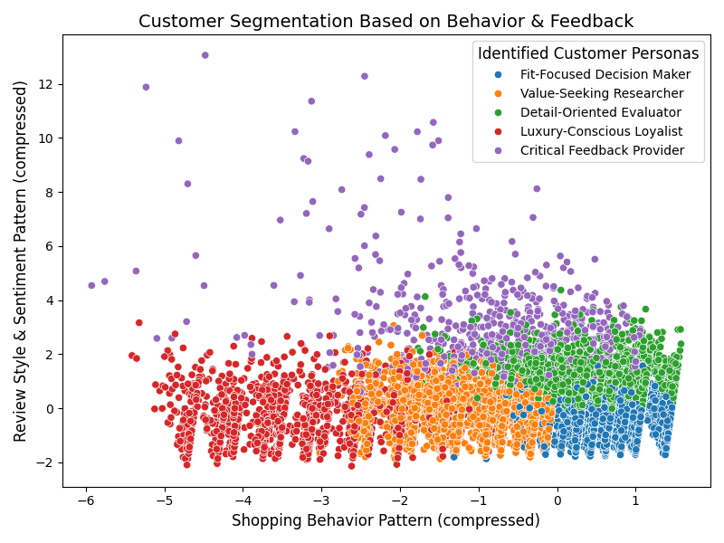

# 💄 AI-powered fashion review analyzer

Built a full-stack machine learning dashboard that analyzes 20,000+ women's clothing reviews using NLP, clustering, predictive modeling, and SHAP explainability. Designed to help fashion brands understand customer sentiment, shopper personas, and product recommendation behavior.

---

## 🎯 Project Objective

Fashion brands get thousands of customer reviews — but how do they know what people are really saying?

This app uses AI to:
- Detect **emotions** in reviews (Sentiment Analysis)
- Uncover **topics/themes** people talk about (Topic Modeling)
- Cluster buyers into **personas** based on behavior (Clustering)
- Predict if someone will **recommend a product** (ML Modeling)
- Explain **why** the model made that prediction (SHAP)

---

## 🧱 Full Project Architecture
📁 data/

├── raw_reviews.csv 

├── cleaned_reviews.csv


├── sentiment_reviews.csv

├── topic_reviews.csv

├── persona_reviews.csv

📁 notebooks/

├── 01_data_cleaning.py

├── 02_eda.py

├── 03_sentiment.py

├── 04_topic_modeling.py

├── 05_clustering.py

├── 06_modeling.py

├── 07_shap_interpretation.py

📁 models/

└── recommendation_model.pkl

📁 app/

└── streamlit_app.py

📁 assets/

├── age_distribution.png

├── ratings_by_department.png

├── persona_clusters.png


---

## 🔍 Key Features

### 📊 Sentiment Analysis
Used **VADER** to label every review as **Positive**, **Negative**, or **Neutral** — instantly understand overall brand vibe.

### 🧵 Topic Modeling
Used **LDA (Latent Dirichlet Allocation)** to identify 5 key themes like:
- “Sizing & Fit Issues”
- “Material Complaints”
- “Style & Comfort Praise”

### 👗 Customer Personas
Clustered shoppers using **KMeans + PCA** to reveal 5 key buyer types:
- Luxury-Conscious Loyalist
- Value-Seeking Researcher
- Fit-Focused Decision Maker
- Critical Feedback Provider
- Detail-Oriented Evaluator

### 🔮 Recommendation Predictor
Trained an **XGBoost Classifier** to predict whether a customer would recommend a product, based on:
- Age
- Rating
- Sentiment Score
- Topic
- Persona

### 🧠 Explainability (SHAP)
Integrated **SHAP** to interpret model predictions and highlight top influencing features for transparency and trust.

---

## 💻 App Demo

 <!-- Replace with demo GIF or app screenshot -->

> ⚡ Built using **Streamlit**  
> 🎨 Customized UI with HTML/CSS inside Streamlit  
> 💡 All logic modularized in Jupyter notebooks  
> 📈 Deployed-ready project for recruiters + portfolio

---

## 🚀 How to Run

```bash
# Clone this repo
git clone https://github.com/your-username/your-repo-name.git
cd your-repo-name

# Install dependencies
pip install -r requirements.txt

# Launch the dashboard
streamlit run app/streamlit_app.py
```
## 🛠️ Tech Stack

| 🧰 Tool              | ⚙️ Purpose                    |
|----------------------|-------------------------------|
| **Python**           | Core scripting                |
| **Pandas**           | Data wrangling                |
| **VADER**            | Sentiment analysis            |
| **Gensim**           | Topic modeling (LDA)          |
| **KMeans + PCA**     | Clustering + Visualization    |
| **XGBoost**          | Recommendation model          |
| **SHAP**             | Explainability                |
| **Streamlit**        | Frontend UI                   |
| **Matplotlib / Seaborn** | Plots + Insights         |


## 🤝 Project Use Cases
Fashion brand managers analyzing product reviews

E-commerce analysts segmenting shopper behavior

Data scientists showcasing full NLP→ML→Explainability pipeline

Recruiters assessing ML model interpretability + UI polish

## ✨ Final Thoughts
✅ End-to-end ML pipeline

✅ Dashboard-ready with UX in mind

✅ Built with 0 paid tools, 100% skill

## Dataset:

https://www.kaggle.com/datasets/nicapotato/womens-ecommerce-clothing-reviews

## APP

[](https://fashion-review-analytics.streamlit.app/](https://fashion-review-analytics-lgsm9q8g4vtresyrjxm6gx.streamlit.app/))

